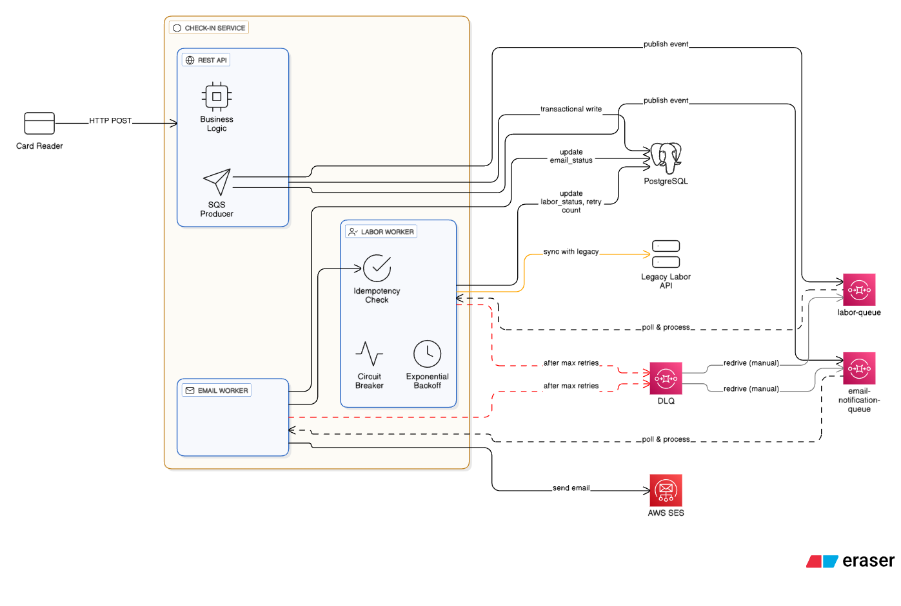

# Check-in Service (Go 1.25)

A high-concurrency, resilient backend service built in Go for factory worker time tracking. This service decouples synchronous user actions from unpredictable third-party API calls and email notifications using a fan-out message queue architecture.

## 🏗️ System Architecture

The system is designed using the **Hexagonal (Ports and Adapters)** pattern, separating business logic from external infrastructure like PostgreSQL, AWS SQS, and AWS SES.



### Core Workflow

The core objective is to ensure that a failure in an external dependency (the Legacy API or Email Service) does not block the primary business event (recording the worker's time).

---
#### 1. The Synchronous Request (API Layer)

When the card reader makes an HTTP POST request, the API service executes a transactional write to the PostgreSQL database. This record serves as the "Source of Truth."

Immediately after the database write, the API service performs a Fan-out by publishing two separate messages to AWS SQS.

- Response: The API returns an HTTP 202 Accepted to the card reader.

- Outcome: The card reader's connection is closed quickly, and the data is now safely persisted in both a relational database and a durable message queue.

---
#### 2. The Asynchronous Labor Worker

This worker is a dedicated process that polls the labor-queue. Its sole responsibility is to synchronize our internal data with the Legacy Labor Recording System.

- Circuit Breaker Logic: The worker monitors the error rate of the Legacy API. If the API returns 429 (Rate Limit) or 5xx (Server Error) consistently, the breaker trips to the Open state. This prevents the worker from making outbound calls, preserving the Legacy API's resources while it recovers.

- Exponential Backoff: When a call fails, the worker updates the labor_retry_count in the database and adjusts the SQS Visibility Timeout. This ensures the message is retried at increasing intervals, reducing the frequency of attempts during prolonged outages.

---
#### 3. The Asynchronous Email Worker

This is a parallel, independent process polling the email-notification-queue.

- Isolation: Because this worker operates on its own queue, it is completely unaffected by the status of the Legacy Labor System. Even if the Labor Worker is stuck in a retry loop, the Email Worker continues to process notifications at full speed.

- Finalization: Once Amazon SES confirms the email is sent, the worker updates the email_status in the database to COMPLETED.

---

#### 4. Failure Handling and Dead Letter Queues (DLQ)
If a specific event fails to be processed after the maximum number of retries (e.g., 10 attempts), AWS SQS moves that message to a Dead Letter Queue.

- Audit Trail: By looking at the PostgreSQL table, you can identify "orphaned" records where one status is COMPLETED and the other is FAILED.

- Recovery: Once the root cause of the failure is resolved (e.g., a bug in the message format or a credential issue), the messages in the DLQ can be "redriven" back into the primary queues for reprocessing.

---

## 📂 Project Structure

```text
checkin-service/
├── cmd/
│   ├── api/             # REST API entry point
│   ├── labor-worker/    # Legacy API integration worker
│   └── email-worker/    # Notification worker
├── internal/
│   ├── api/             # Gorilla/mux router and handlers
│   ├── core/            # Domain logic & Service orchestration
│   │   └── model/       # Go structs (WorkingTime)
│   ├── worker/          # SQS Consumer & Processor logic
│   └── ports/           # Interfaces (Ports) & Adapters
│       ├── repository/  # PostgreSQL implementation
│       └── messaging/   # SQS Producer & SES Email client
└── pkg/                 # Shared utilities (DB connection, Logging)
└── tools/               # Legacy mock api, localstack for local AWS testing

```
<br>

---
<br>
<br>

## 🛠️ Resilience & Error Handling

The service is built to survive transient failures and prevent cascading outages in the factory's legacy infrastructure.

### 1. Circuit Breaker Pattern (`sony/gobreaker`)
The **Labor Worker** wraps all outbound calls to the Legacy Labor System in a Circuit Breaker. 

* **Closed State:** Normal operation. Requests flow to the Legacy API.
* **Open State:** If the Legacy API returns a high rate of `5xx` or `429` (Rate Limit) errors, the breaker trips. Subsequent requests fail immediately at the worker level, preventing the legacy system from being overwhelmed.
* **Half-Open State:** After a timeout period, the breaker allows a single "probe" request to see if the legacy system has recovered.

### 2. Smart Retries with Exponential Backoff
Instead of immediate retries, the workers use an exponential delay capped at 1 hour. This ensures that a struggling service has time to recover.

The delay is calculated using the following logic:

Delay = math.Pow(2, float64(retryCount)) * 10

| Attempt | Calculation | Delay Duration |
| :--- | :--- | :--- |
| 1st Retry | 2^1 \times 10 | 20 seconds |
| 5th Retry | 2^5 \times 10 | 320 seconds (~5.3 min) |
| 9th Retry | 2^9 \times 10 | 5,120 **3,600** (Capped) |
| 10th Retry | 2^10 \times 10 | **3,600 seconds (1 hour)** |


**Implementation Note:** The worker updates the SQS `VisibilityTimeout` using the result of `calculateBackoff(retryCount)`, ensuring the message stays hidden from other workers until the backoff period has passed.

### 3. Dead Letter Queue (DLQ) & Manual Triage
If a message exceeds the **MaxReceiveCount** (set to 10), AWS SQS automatically moves the message to the `checkin-dlq`.
* **Purpose:** Prevents "Poison Pill" messages (e.g., malformed data that will never succeed) from cycling infinitely.
* **Recovery:** Engineers can inspect the DLQ, fix the root cause, and redrive the messages back to the main queue using the SQS console or CLI.

### 4. Idempotent Processing
Since SQS guarantees "at-least-once" delivery, workers perform a **Check-then-Act** operation:
1.  Worker receives message.
2.  Worker queries PostgreSQL for the current `labor_status`.
3.  If status is already `COMPLETED`, the worker acknowledges (deletes) the message without re-processing.
<br>

---
<br>
<br>

## 🔍 Observability Stack

### Distributed Tracing (OpenTelemetry)
* **Propagation:** Traces are propagated across SQS using the `traceparent` message attribute.
* **Visualization:** Connect to Jaeger or Grafana Tempo to see the full request lifecycle.
* **Instrumentation:** Automatic instrumentation for `net/http` and `database/sql` is enabled.

### Metrics (Prometheus)
* **Endpoint:** `:2112/metrics`
* **Custom Metrics:**
    * `factory_checkin_total`: Counter for all check-in attempts (labeled by `status: success|failure`).
    * `legacy_api_request_duration_seconds`: Histogram of latency for the third-party integration.
    * `sqs_queue_depth`: Gauge updated by the worker to monitor lag.

---

# Local Development & Testing Guide

This guide provides all the necessary steps to run, interact with, and verify the `checkin-service` application on your local machine using Docker Compose.

### 1. Prerequisites

Before you begin, ensure you have the following software installed:
*   **Docker** and **Docker Compose**: The easiest way to get both is by installing Docker Desktop.

### 2. Running the Application

Navigate to the root directory of the project (`c:\Dev\checkin-service\`) in your terminal and run the following command to build the application images and start all services.

```bash
docker-compose up --build
```

*   `docker-compose up`: Starts all services defined in `docker-compose.yml`.
*   `--build`: Forces a rebuild of the Go application images, which is essential after making code changes.

You will see logs from all services streaming in your terminal. To run the services in the background (detached mode), you can add the `-d` flag:

```bash
docker-compose up -d --build
```

### 3. Interacting with the API

Once the services are running, the main API is exposed on `http://localhost:8080`. You can use a tool like `curl` to send requests.

#### Check-In an Employee
Send a `POST` request to the `/check-in` endpoint to simulate a worker clocking in.

```bash
curl -X POST http://localhost:8080/check-in -H "Content-Type: application/json" -d '{"employee_id": "emp-123"}'
```

#### Check-Out an Employee
Send a `POST` request to the `/check-out` endpoint to simulate the same worker clocking out.

```bash
curl -X POST http://localhost:8080/check-out -H "Content-Type: application/json" -d '{"employee_id": "emp-123"}'
```

### 4. Verifying the Workflow

After interacting with the API, you can inspect the different parts of the system to verify that the asynchronous workflows have been triggered.

#### Check the Database
You can connect to the PostgreSQL database from your host machine using any database client (like DBeaver, pgAdmin, or `psql`).

*   **Host**: `localhost`
*   **Port**: `5432`
*   **User**: `user`
*   **Password**: `password`
*   **Database**: `checkin_db`

Run a query to see the records and their processing statuses:
```sql
SELECT id, employee_id, labor_status, email_status, clock_in_time, clock_out_time FROM working_times;
```

#### Check the SQS Queues
You can inspect the messages in the SQS queues managed by LocalStack using `awslocal` inside the `localstack` container.

To see messages in the **labor queue**:
```bash
docker exec checkin_localstack awslocal sqs receive-message --queue-url http://localhost:4566/000000000000/labor-queue
```

To check the **dead-letter queue** if a message fails processing multiple times:
```bash
docker exec checkin_localstack awslocal sqs receive-message --queue-url http://localhost:4566/000000000000/labor-queue-dlq
```

#### View Service Logs
To view the real-time logs for a specific service, use the `docker logs` command with the `-f` (follow) flag.

For example, to see what the `checkin-worker` is doing:
```bash
docker logs -f checkin_worker
```

### 5. Stopping the Application

When you are finished, you can stop all the running containers from the project's root directory.

```bash
docker-compose down
```

If you also want to remove the database data (the `checkin_db_data` volume), add the `-v` flag:

```bash
docker-compose down -v
```

---

# AI Usage:
- Eraser.io: To generate a nice looking diagram. Input: the core flow of the app as a text
- Gemini plugin for VSC: 
    - To generate the docker-compose file and Dockerfiles for each service and localstack
    - Fix errors on docker-compose up
    - Fix errors on compile
    - Generate mock api
- Copilot to generate commit messages (Github desktop)

--- 
# Improvements
- Add openTelemetry and Prometheus logic to track and create custom metrics
